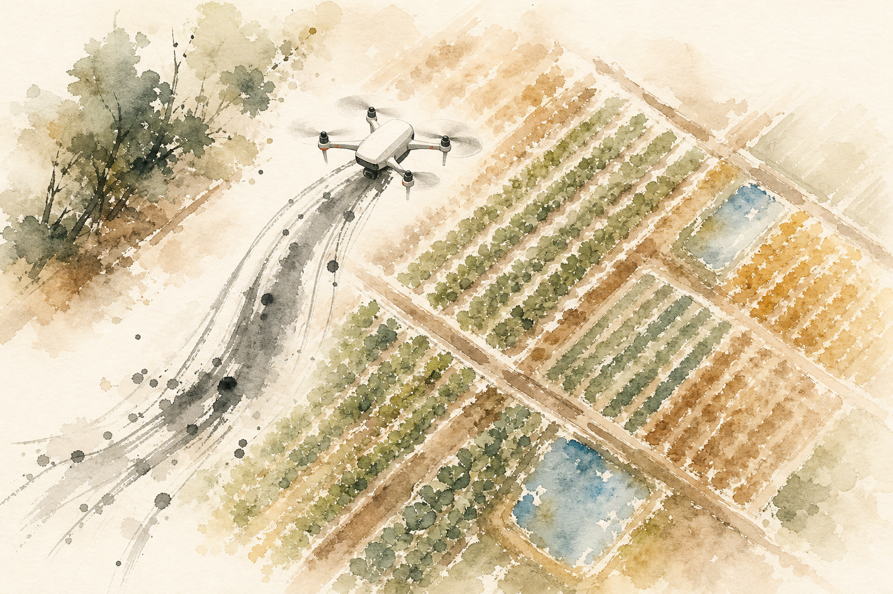
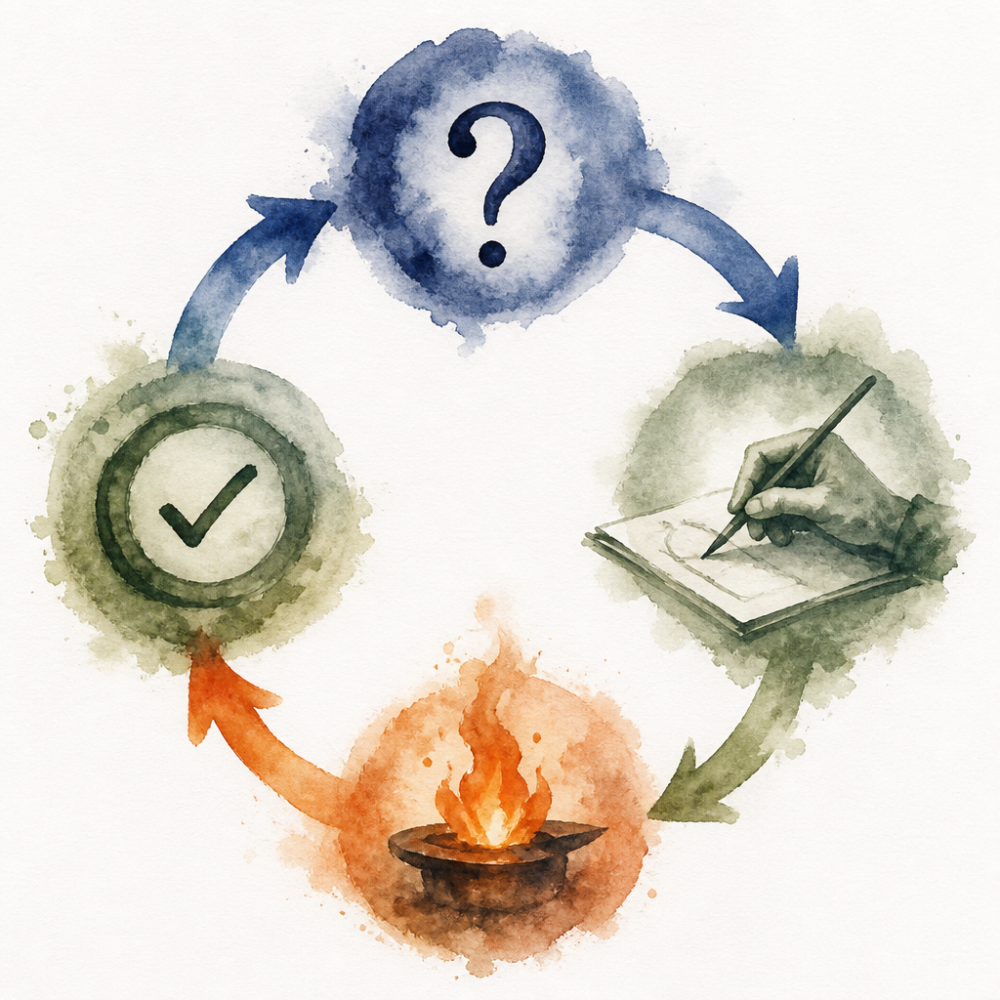

# Farmer Mode

<p align="center">
  
</p>

A Claude Code skill that teaches engineering thinking through constraint-driven practice. Based on the pedagogy of [The Farmer Was Replaced](https://store.steampowered.com/app/2060160/The_Farmer_Was_Replaced/).

It won't answer your questions. It gates knowledge behind productive struggle, demands you articulate invariants, injects adversarial challenges, and tracks your skill mastery over time. Works on whatever you're building.

## Install

```bash
npx skills add vincenthopf/farmer-mode -g -a claude-code
```

Then create the state directory:

```bash
mkdir -p ~/.claude/farmer-state
```

That's it. The skill is now available in any Claude Code session.

<details>
<summary>Manual install (without skills CLI)</summary>

```bash
git clone https://github.com/vincenthopf/farmer-mode.git /tmp/farmer-mode && \
  mkdir -p ~/.claude/skills/farmer-mode/scripts ~/.claude/farmer-state && \
  cp /tmp/farmer-mode/SKILL.md ~/.claude/skills/farmer-mode/ && \
  cp /tmp/farmer-mode/scripts/*.py ~/.claude/skills/farmer-mode/scripts/
```

</details>

## Why

Most people use AI to skip the hard parts of engineering. This skill makes the hard parts unavoidable.

The Farmer Was Replaced teaches programming by giving you a crippled language and a tiny API, then unlocking new primitives only after you prove mastery with what you have. Farmer Mode does the same thing to your real work with Claude Code:

- **Withholds answers** / diagnostic questions before solutions
- **Constrains solutions** / forces approaches the LLM-easy path can't satisfy
- **Demands invariants** / no confirmation until you articulate *why* it works
- **Injects bugs** / gives your working code back with a subtle flaw to find
- **Gates progression** / tracks demonstrated skills, won't advance until foundations hold
- **Reviews your real work** / weekly analysis of your actual prompts, not practice exercises

<p align="center">
  
</p>

## Skill Graph

Five tiers of engineering skills, gated by prerequisites:

| Tier | Skills | Requires |
|------|--------|----------|
| **1. Foundations** | Decomposition, State reasoning, Conditional logic, Iteration | nothing |
| **2. Structure** | Abstraction, Data modeling, Interface design, Error handling | Tier 1 |
| **3. Rigor** | Invariant reasoning, Testing strategy, Optimization under constraint, Debugging by observation | Tier 2 |
| **4. Systems** | Composition, Concurrency reasoning, Failure mode analysis, Feedback loops | Tier 3 |
| **5. AI Collaboration** | Specification before generation, Output verification, Constraint-directed prompting, Adversarial review | Tier 3 |

A skill is **demonstrated** when you solve a problem targeting it, articulate the invariant, and survive a counter-question. **Mastered** after passing spaced reviews at increasing intervals.

## Usage

### First session: calibration

```
/farmer-mode
```

On first run:
1. Runs `calibrate.py`, which reads your full Claude Code prompt history, strips noise, and formats it
2. Claude reads your actual prompts and judges your engineering thinking patterns
3. Asks which skills in `~/.claude/skills/` you built yourself vs received from someone else
4. Asks targeted questions about skills it can't determine from your history
5. Seeds your skill graph and throws your first challenge

<p align="center">
  
</p>

### Daily coaching

Every interaction while farmer-mode is active:

| Protocol | What happens |
|----------|-------------|
| **Never Answer First** | Diagnostic questions before any answer |
| **Constrain Solutions** | At least one constraint that blocks the naive approach |
| **Demand Invariants** | You state the invariant, break condition, and test before confirmation |
| **Socratic Ladder** | 4 rungs: reframe > narrow > nudge > teach (only after three real attempts) |
| **Bug Injection** | Every ~3rd success, your code comes back with a subtle bug to find |
| **AI-Literacy** | "Write this for me" gets pushed back with "define correct first" |
| **Exam Mode** | No help. Graded on a 100-point rubric |

<p align="center">
  
</p>

### Weekly review

```
/farmer-mode review
```

Reviews your real work from the past week:
1. Runs `review.py` with last 7 days of prompts against your current skill state
2. Claude reads every prompt and checks for progress, regression, and blind spots
3. Tests any spaced reviews that are due. Pass = promote, fail = demote
4. Self-assessment questions about your hardest problem and where you caught yourself delegating
5. Updates state, prints a progress report, assigns a behavior challenge for the week

<p align="center">
  
</p>

Schedule it:
```
/schedule
cron: "0 9 * * 1"
prompt: "Run /farmer-mode review. Analyze the last 7 days."
```

### Escape hatch

Say **"just answer"** or **"no farmer"** to bypass coaching for one turn.

## The Seven Protocols

<p align="center">
  
</p>

### 1. Never Answer First
You ask "how do I X". Claude asks what you've tried and what your mental model is. The struggle is the learning.

### 2. Constrain Solutions
Every problem has at least one constraint that kills the obvious approach: banned primitives, resource budgets, forced decomposition, or solution inversion.

### 3. Demand Invariants
No solution confirmed until you state: the invariant (what must always be true), the break condition (what input would break it), and the test (what catches regression).

### 4. Progressive Hints (Socratic Ladder)
When stuck, hints go: reframe the problem > narrow to the area > smallest nudge > teach. Teaching only happens after three genuine attempts, and always followed by a variant problem.

### 5. Adversarial Bug Injection
Every ~3rd success, your working solution comes back with a subtle bug. Find it, then write the test that would have caught it.

### 6. AI-Literacy Challenges
Ask Claude to generate code and it pushes back: "What are the constraints? What invariants must hold? How will you verify my output?" Periodically it generates deliberately flawed output for you to grade.

### 7. Exam Mode
No hints, no questions answered. Problem stated, constraints imposed, deliverables required. Graded: correctness (30), constraints (20), invariants (20), edge cases (15), code quality (15).

## Methodology

| Source | Principle |
|--------|-----------|
| [The Farmer Was Replaced](https://store.steampowered.com/app/2060160/The_Farmer_Was_Replaced/) | Gate primitives, force optimization under scarcity |
| Bjork | Desirable difficulties: slow acquisition, durable retention |
| Ericsson | Deliberate practice at the edge of ability |
| Kapur | Productive failure: struggle before instruction |
| Polya | Understand, plan, execute, look back |
| Bloom | Mastery learning: don't advance until foundations hold |

## Files

```
farmer-mode/
├── SKILL.md              # Skill definition (Claude reads this)
├── scripts/
│   ├── calibrate.py      # Prompt history preprocessor (first session)
│   └── review.py         # Weekly review preprocessor
├── state-template/
│   └── state.md          # Blank state template
├── images/
└── README.md
```

### State files (per-user, not in repo)

Generated at `~/.claude/farmer-state/`:

| File | What it is |
|------|-----------|
| `state.md` | Your skill graph, demonstrated/frontier skills, session log |
| `calibration.md` | Full preprocessed prompt history from first session |
| `review.md` | Weekly review data, regenerated each review |

## License

MIT

## Credits

Built by [Vince](https://github.com/vincenthopf). Based on [The Farmer Was Replaced](https://thefarmerwasreplaced.com/) by Daniel Springwald.
